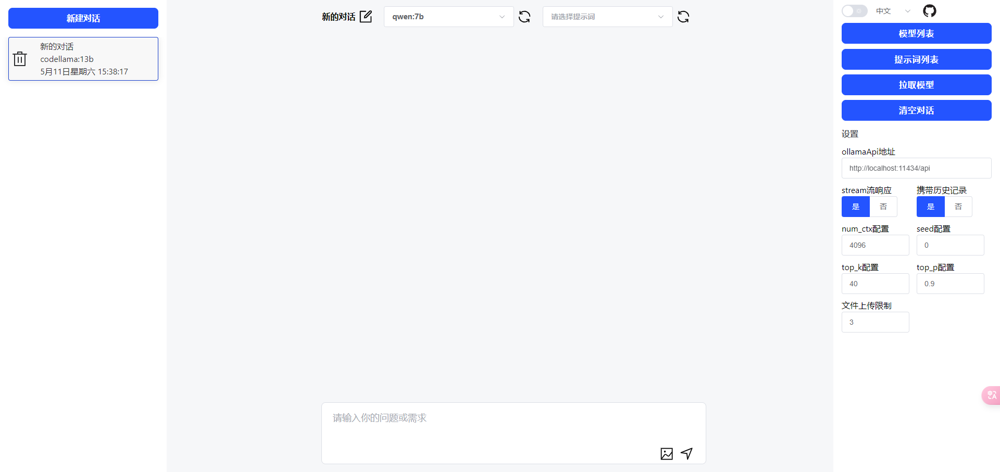

## a web application for chatting with local LLMs by ollama API

[CHINESE README](./README_ZH.md)  
[ENGILSH README](./README.md)




## install and use ollama

- [ollama homepage](https://ollama.com/)
- download and install [ollama CLI](https://ollama.ai/download)

## getting started
- clone this repository
- use npm install && run dev
- use cmd to run ollama

```
git clone https://github.com/GGMGG/ollamaWeb.git
npm install
npm run dev
```

```
ollama serve
```

## built with

- [Ollama.ai](https://ollama.ai/)
- [Vue.js](https://vuejs.org/)
- [Vite](https://vitejs.dev/)
- [VueUse](https://vueuse.org/)
- [VueI18n](https://vue-i18n.intlify.dev/)
- [element-plus](https://element-plus.org/)

## learn from

- [ollama-gui](https://github.com/HelgeSverre/ollama-gui/)

---

## license

Licensed under the MIT License. See the [LICENSE](./LICENSE) file for details.