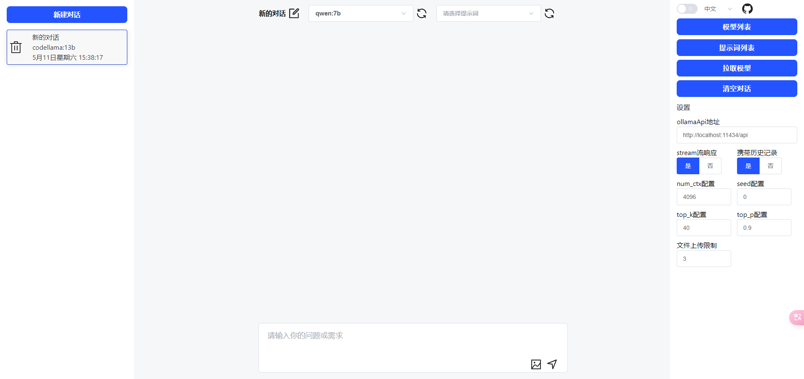
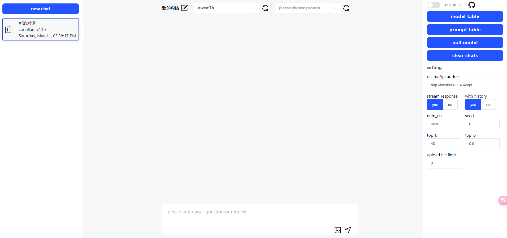

## 一个通过ollama API与本地LLMs聊天的小工具

[中文说明](./README_ZH.md)  
[英文说明](./README.md)




## 安装并使用ollama

- [ollama homepage](https://ollama.com/)
- download and install [ollama CLI](https://ollama.ai/download)

## 开始
- 克隆代码
- 运行npm install安装依赖，运行npm run dev运行网页
- 根据不同平台执行不同的cmd脚本，在本地运行ollama服务

```
git clone https://github.com/GGMGG/ollamaWeb.git
npm install
npm run dev
```

```
ollama serve
```

## 构建

- [Ollama.ai](https://ollama.ai/)
- [Vue.js](https://vuejs.org/)
- [Vite](https://vitejs.dev/)
- [VueUse](https://vueuse.org/)
- [VueI18n](https://vue-i18n.intlify.dev/)
- [element-plus](https://element-plus.org/)

## 学习项目

- [ollama-gui](https://github.com/HelgeSverre/ollama-gui/)

---

## 许可证

在MIT许可证下授权。有关详细信息，请参阅[LICENSE](./LICENSE)文件。